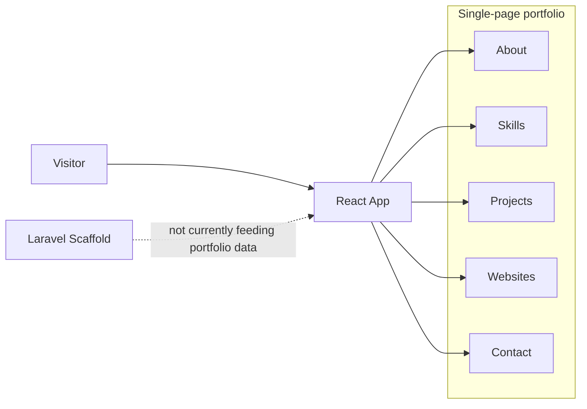
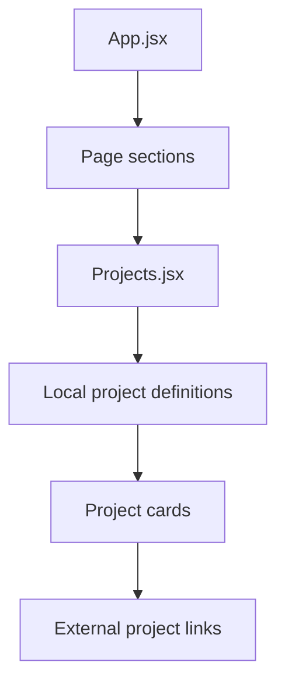
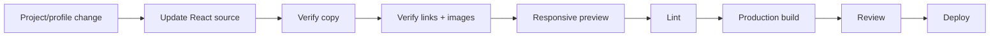
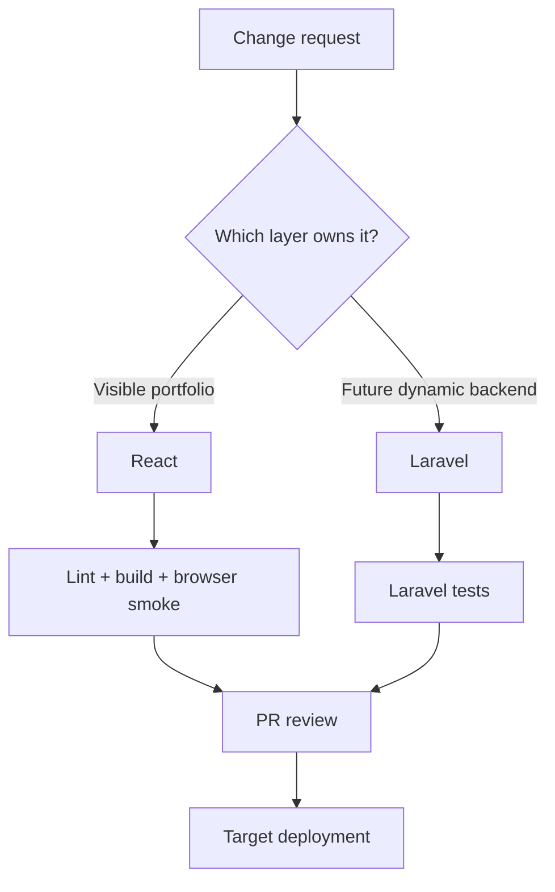
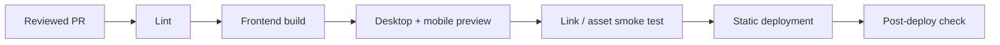
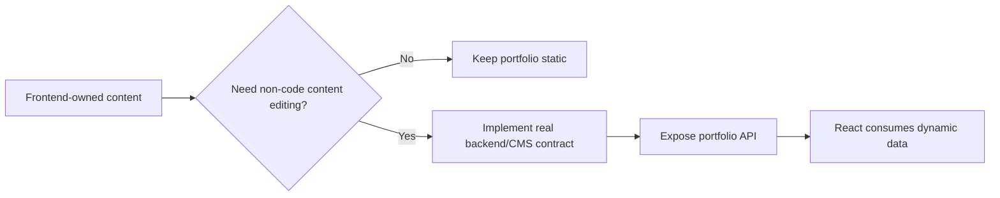

# 🧑‍💻 Portofolio-2025 — Engineering Blueprint

> **Personal portfolio delivery map:** React owns the visible experience today; Laravel remains a separate scaffold and should not be described as an active CMS yet.

**Reviewed snapshot:** `main` @ [`9e42aab2635c`](https://github.com/HidayahMF/Portofolio-2025/commit/9e42aab2635cae653ec43485910abec0925c7027) — 2026-09-17

## ⚡ Project pulse

| Area | Current implementation |
| --- | --- |
| Visitor UI | React + Vite |
| Portfolio content | Local frontend source |
| Backend | Laravel scaffold |
| CMS integration | Not established |
| Automated CI | No `.github/workflows/` found |

## 🏗️ Experience architecture

## 🧭 Content rendering flow

The visible portfolio is therefore **frontend-owned** in the reviewed source.

## 🗺️ Code ownership map

| Source | Responsibility | Status |
| --- | --- | --- |
| [`frontend/src/App.jsx`](https://github.com/HidayahMF/Portofolio-2025/blob/9e42aab2635cae653ec43485910abec0925c7027/frontend/src/App.jsx) | Main page composition | Active |
| [`frontend/src/components/Projects.jsx`](https://github.com/HidayahMF/Portofolio-2025/blob/9e42aab2635cae653ec43485910abec0925c7027/frontend/src/components/Projects.jsx) | Project content/cards | Active |
| [`backend/routes/web.php`](https://github.com/HidayahMF/Portofolio-2025/blob/9e42aab2635cae653ec43485910abec0925c7027/backend/routes/web.php) | Laravel web route | Welcome scaffold |
| [`PortfolioController.php`](https://github.com/HidayahMF/Portofolio-2025/blob/9e42aab2635cae653ec43485910abec0925c7027/backend/app/Http/Controllers/Admin/PortfolioController.php) | Potential future dynamic portfolio logic | Methods empty |

## ✍️ Content update pipeline

## 🚀 Engineering pipeline

### Declared commands

| Area | Commands |
| --- | --- |
| React frontend | `npm run dev`, `npm run lint`, `npm run build` |
| Laravel scaffold | `composer dev`, `composer test`, `npm run build` |

## 🛡️ Quality gates

| Gate | Pass condition |
| --- | --- |
| Navigation | Every anchor reaches the intended section |
| Project integrity | Descriptions match implemented work |
| External links | Project/contact URLs resolve correctly |
| Assets | Images render with useful fallbacks / alt text |
| Responsive UI | Desktop + mobile remain readable |
| Build | Frontend production build completes |
| Backend claims | Laravel is not presented as an active CMS until it actually drives content |

## ⚠️ Risk radar

| Priority | Finding | Why it matters |
| --- | --- | --- |
| 🟠 Medium | `PortfolioController` methods are empty | Backend functionality can be overstated easily |
| 🟠 Medium | Laravel route still serves welcome content | Backend is not the portfolio runtime shown to visitors |
| 🟡 Low | Root `npm run test` is a placeholder | It should not be counted as real automated coverage |
| 🟡 Low | Portfolio data lives in source | Every content change currently requires a code change |

## 🌐 Release path

No GitHub Actions workflow was found in the reviewed snapshot, so this remains a documented manual release path unless CI is added later.

## 📌 Evolution path

---

### Keeping this blueprint accurate

Update the diagrams whenever content ownership changes. The moment Laravel starts serving real portfolio data, replace the dotted scaffold relationship with the actual request/data flow.
