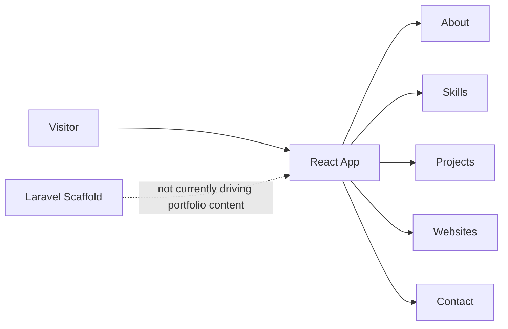
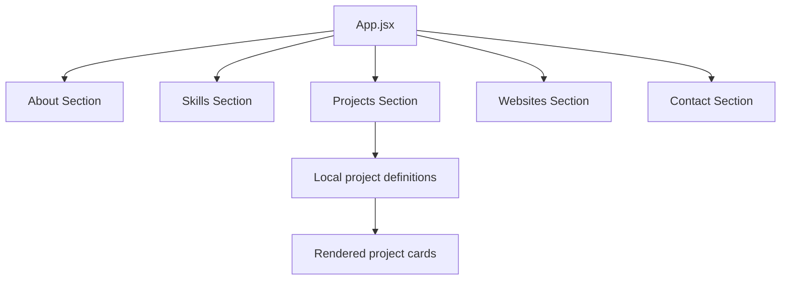
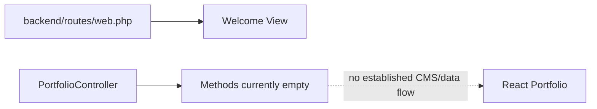
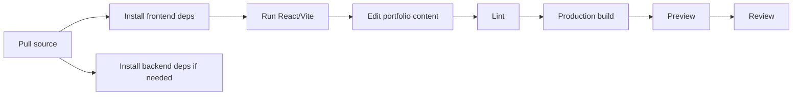
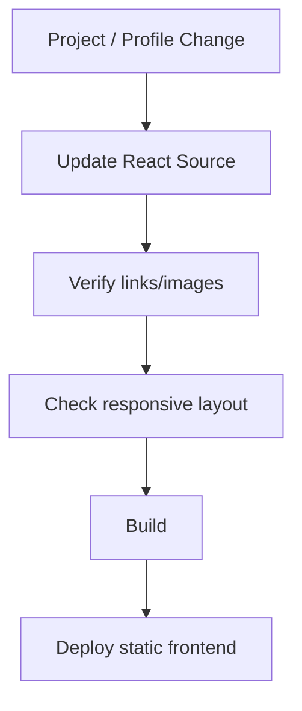
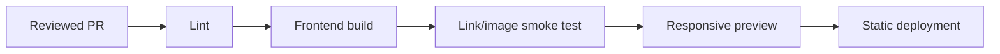

# Portofolio-2025 — Development Pipeline

> Code-grounded architecture and delivery guide for the current repository snapshot. Reviewed from `main` at `9e42aab2635c` on 2026-09-17.

This repository contains a React portfolio frontend and a separate Laravel scaffold. The visible portfolio content is currently driven by frontend source rather than a working CMS/backend integration.

## 1. Current architecture

## 2. Portfolio rendering flow

## 3. Current backend status

## 4. Runtime ownership

| Layer | Responsibility | Key source |
| --- | --- | --- |
| React app | Main page composition | `frontend/src/App.jsx` |
| Projects component | Visible project cards/content | `frontend/src/components/Projects.jsx` |
| Laravel routes | Current backend web route | `backend/routes/web.php` |
| Portfolio controller | Backend scaffold for future dynamic content | `PortfolioController.php` |

## 5. Development pipeline

| Directory | Command | Purpose |
| --- | --- | --- |
| `frontend` | `npm run dev` | Portfolio dev server |
| `frontend` | `npm run build` | Portfolio production build |
| `frontend` | `npm run lint` | Frontend lint |
| `backend` | `composer dev` | Laravel dev stack |
| `backend` | `composer test` | Laravel tests |
| `backend` | `npm run build` | Laravel-side Vite build |

## 6. Content update pipeline

## 7. Verification gates

- Every navigation anchor lands on the correct section.
- Every external project/contact link is valid.
- Images have usable fallbacks/alt text.
- Project descriptions match what is actually implemented.
- Mobile/tablet breakpoints remain readable.
- Static build completes successfully.
- Laravel example tests are not counted as portfolio feature coverage.

## 8. Release pipeline

No GitHub Actions workflow was found in the reviewed snapshot.

## 9. Known gaps

1. `PortfolioController` methods are empty.
2. `backend/routes/web.php` currently serves the Laravel welcome view.
3. A working frontend-to-backend portfolio CMS flow is not established by the reviewed source.
4. Root-level `npm run test` is a placeholder and should not be treated as real coverage.

## 10. Source map

- [`frontend/src/App.jsx`](https://github.com/HidayahMF/Portofolio-2025/blob/9e42aab2635cae653ec43485910abec0925c7027/frontend/src/App.jsx)
- [`frontend/src/components/Projects.jsx`](https://github.com/HidayahMF/Portofolio-2025/blob/9e42aab2635cae653ec43485910abec0925c7027/frontend/src/components/Projects.jsx)
- [`backend/routes/web.php`](https://github.com/HidayahMF/Portofolio-2025/blob/9e42aab2635cae653ec43485910abec0925c7027/backend/routes/web.php)
- [`backend/app/Http/Controllers/Admin/PortfolioController.php`](https://github.com/HidayahMF/Portofolio-2025/blob/9e42aab2635cae653ec43485910abec0925c7027/backend/app/Http/Controllers/Admin/PortfolioController.php)

Keep this guide synchronized with portfolio content ownership and any future CMS/backend integration.